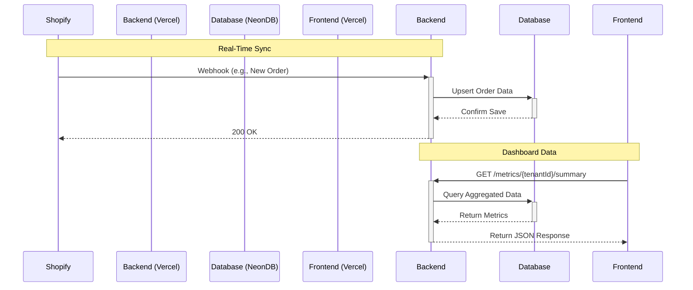

# Shopify Data Ingestion & Insights Service

This project is a full-stack, multi-tenant service designed to ingest and analyze customer data from Shopify stores. It simulates how a B2B SaaS application would onboard enterprise retailers, sync their data in real-time, and provide valuable business insights through a clean, modern dashboard.

## Live Demo

* **Frontend Dashboard**: [https://xeno-dashboard.vercel.app/](https://xeno-dashboard.vercel.app/)
* **Backend API**: [https://xeno-shopify-insights.vercel.app/](https://xeno-shopify-insights.vercel.app/)

## Features

-   **Multi-Tenant Architecture**: The backend is designed to handle data from multiple Shopify stores, with all data strictly isolated by a `tenantId`.
-   **Data Ingestion**: Syncs essential Shopify data including Products, Customers, and Orders via REST API for initial backfill.
-   **Real-Time Sync**: Implements Shopify Webhooks to capture events like `Order Creation` in real-time, ensuring the data is always up-to-date.
-   **Insights Dashboard**: A clean React-based frontend that visualizes key business metrics, including total revenue, order counts, and top customers by spend.
-   **REST API**: A well-defined Node.js (Express) API to handle data ingestion, tenant management, and metric queries.

## Tech Stack

| Category      | Technology                                       |
| ------------- | ------------------------------------------------ |
| **Frontend** | React.js, Axios, Chart.js                        |
| **Backend** | Node.js, Express.js                              |
| **Database** | PostgreSQL (hosted on NeonDB)                    |
| **ORM** | Prisma                                           |
| **Deployment**| Vercel (for both Frontend and Backend)           |

## Architecture

The application follows a standard decoupled, three-tier architecture.

1.  **Shopify Store**: Acts as the primary data source. Events (like a new order) trigger a webhook.
2.  **Backend (Node.js/Express)**: A service deployed on Vercel that listens for webhooks and provides a REST API. It verifies incoming webhooks, processes the data, and stores it in the database.
3.  **Database (PostgreSQL)**: Hosted on NeonDB, it stores all tenant and Shopify data. Data is isolated using a foreign key relationship to a `Tenant` table.
4.  **Frontend (React)**: A single-page application deployed on Vercel. It fetches aggregated data from the backend's metrics API and visualizes it using Chart.js.



## Database Schema

The schema is managed by Prisma and defines the relationships between Tenants, Shopify Stores, and the ingested data.

<details>
<summary>Click to view Prisma Schema</summary>

```prisma
// /xeno-fde-backend/prisma/schema.prisma

generator client {
  provider = "prisma-client-js"
}

datasource db {
  provider  = "postgresql"
  url       = env("DATABASE_URL")
  directUrl = env("DIRECT_URL")
}

// Tenant = company or client
model Tenant {
  id        String        @id @default(uuid())
  name      String
  stores    ShopifyStore[]
  createdAt DateTime      @default(now())
  updatedAt DateTime      @updatedAt
}

// Shopify store linked to a tenant
model ShopifyStore {
  id          String       @id @default(uuid())
  tenant      Tenant       @relation(fields: [tenantId], references: [id])
  tenantId    String
  shopDomain  String       @unique
  accessToken String
  products    Product[]
  orders      Order[]
  customers   Customer[]
  syncLogs    SyncLog[]
  createdAt   DateTime     @default(now())
  updatedAt   DateTime     @updatedAt
}

// Shopify products
model Product {
  id        String        @id @default(uuid())
  store     ShopifyStore  @relation(fields: [storeId], references: [id])
  storeId   String
  shopifyId String        @unique
  title     String
  price     Float
  currency  String
  createdAt DateTime      @default(now())
  updatedAt DateTime      @updatedAt
}

// Shopify customers
model Customer {
  id        String        @id @default(uuid())
  store     ShopifyStore  @relation(fields: [storeId], references: [id])
  storeId   String
  shopifyId String        @unique
  email     String?
  firstName String?
  lastName  String?
  orders    Order[]
  createdAt DateTime      @default(now())
  updatedAt DateTime      @updatedAt
}

// Shopify orders
model Order {
  id          String        @id @default(uuid())
  store       ShopifyStore  @relation(fields: [storeId], references: [id])
  storeId     String
  shopifyId   String        @unique
  customer    Customer?     @relation(fields: [customerId], references: [id])
  customerId  String?
  totalAmount Float
  currency    String
  createdAt   DateTime      @default(now())
  updatedAt   DateTime      @updatedAt
}

// Track sync jobs (when ingestion happens)
model SyncLog {
  id        String        @id @default(uuid())
  store     ShopifyStore  @relation(fields: [storeId], references: [id])
  storeId   String
  entity    String
  status    String
  message   String?
  createdAt DateTime      @default(now())
}
```
</details>

## API Endpoints

| Method | Endpoint                             | Description                                            |
| ------ | ------------------------------------ | ------------------------------------------------------ |
| `POST` | `/tenant`                            | Creates a new tenant.                                  |
| `POST` | `/shopify/connect`                   | Connects a Shopify store to an existing tenant.        |
| `POST` | `/sync/products`                     | Manually triggers a sync for all products in a store.  |
| `POST` | `/sync/customers`                    | Manually triggers a sync for all customers in a store. |
| `POST` | `/sync/orders`                       | Manually triggers a sync for all orders in a store.    |
| `GET`  | `/metrics/{tenantId}/summary`        | Gets high-level metrics (revenue, orders, customers).  |
| `GET`  | `/metrics/{tenantId}/orders-by-date` | Gets a time-series of orders and revenue.              |
| `GET`  | `/metrics/{tenantId}/top-customers`  | Gets the top 5 customers by total spend.               |
| `POST` | `/webhooks/shopify`                  | Receives real-time webhook events from Shopify.        |

## Local Development Setup

### Prerequisites
-   Node.js (v18 or later)
-   npm or yarn
-   Git
-   A free PostgreSQL database (e.g., from [Neon](https://neon.tech/))

### Backend
1.  **Clone the repository**:
    ```bash
    git clone [https://github.com/Aditya-Chawla-20/xeno-shopify-insights.git](https://github.com/Aditya-Chawla-20/xeno-shopify-insights.git)
    cd xeno-shopify-insights/xeno-fde-backend
    ```
2.  **Install dependencies**:
    ```bash
    npm install
    ```
3.  **Set up environment variables**:
    Create a `.env` file in the `xeno-fde-backend` directory and add your database URLs.
    ```env
    DATABASE_URL="your_neon_pooled_connection_string"
    DIRECT_URL="your_neon_direct_connection_string"
    ```
4.  **Run database migrations**:
    ```bash
    npx prisma migrate dev
    ```
5.  **Start the server**:
    ```bash
    npm run dev
    ```
    The backend will be running at `http://localhost:4000`.

### Frontend
1.  **Navigate to the frontend directory**:
    ```bash
    cd ../xeno-dashboard-frontend
    ```
2.  **Install dependencies**:
    ```bash
    npm install
    ```
3.  **Set up environment variables**:
    Create a `.env.local` file in the `xeno-dashboard-frontend` directory.
    ```env
    REACT_APP_API_URL=http://localhost:4000
    ```
4.  **Start the application**:
    ```bash
    npm start
    ```
    The frontend will open at `http://localhost:3000`.

## Assumptions & Trade-offs
-   **Onboarding**: For simplicity, the service accepts a pre-generated Shopify Admin API token during onboarding. A full production application would implement the complete Shopify OAuth 2.0 flow.
-   **Sync Strategy**: The primary method for data sync is real-time webhooks. Manual sync APIs are provided as a fallback and for initial data backfilling.
-   **Authentication**: The current version does not have user authentication for the dashboard to keep the focus on the data pipeline. This would be a critical addition for a production app.